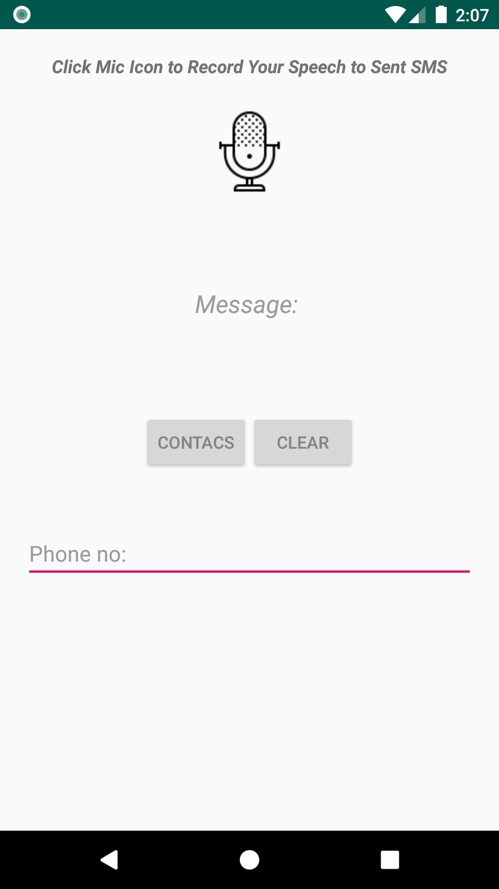
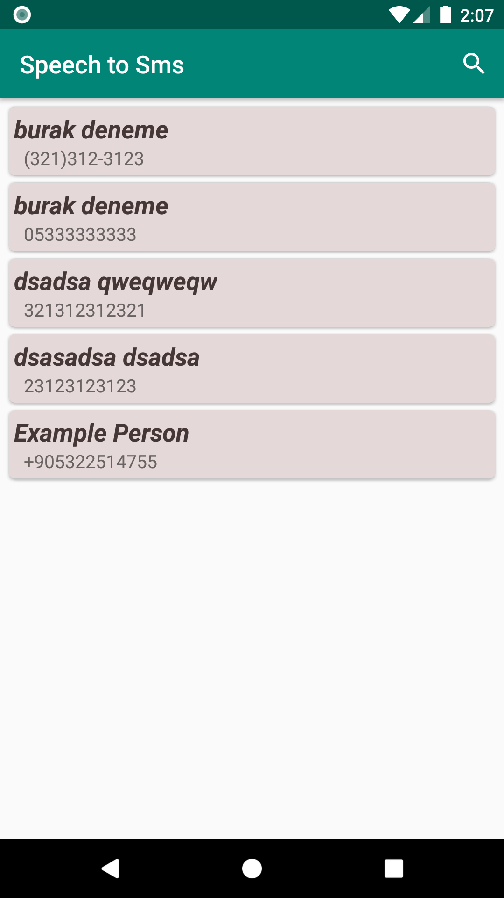
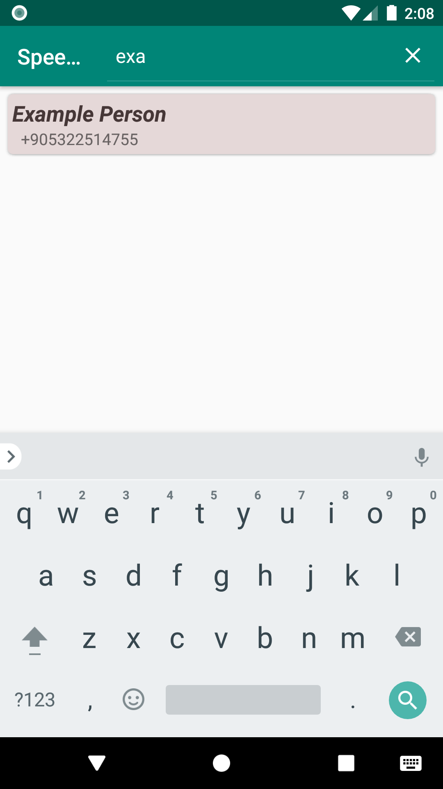

  

This app enables you to send SMS through speech recording.

In order to send SMS to certain number, you need to indicate the country phone code of the phone number that you want to send SMS as follows:

In case of Turkey (Turkey's phone code is +90)
+905301234567

### 24.08.2019
- Search menu is added to facilitate searching in 'contact activity'.

### 27.08.2019
- 'Recylerview widget' is replaced 'listview'.
- Adapter showed wrong contact after filtering (SOLVED).
- Now, contacts are in alphabetical order.

### 28.08.2019
- Now, user will face an "AlertDialog" after hitting "send" button.
- "MainActivity"'s screen, launcher activity's screen, is going to scroll up when the keyboard appears

### 30.08.2019
- App's logo is added.
- Splash screen is added.

## Screenshots

  
   
  
  

